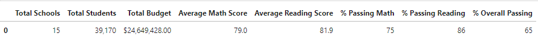
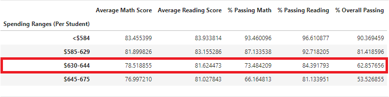
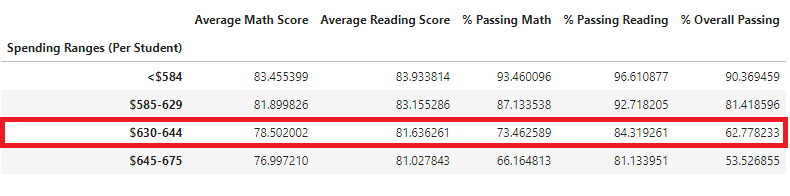
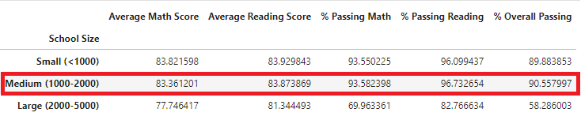

# School_District_Analysis
Module 4 homework

## Table of Contents
- [Overview of Project](#OverviewProject)
  * [Purpose](#purpose)
- [Results](#Results)
  * [District Summary](#DistSumm)
  * [School Summary](#SchoolSumm)
  * [School Ranking](#SchoolRank)
  * [Score By Grade](#ScoreGrade)
  * [Score By School Categories](#SchoolCat)
    * [School Spending Brackets](#SchoolSpend) 
    * [School Size Brackets](#SchoolSize) 
    * [School Types Brackets](#SchoolType) 
- [Summary](#Summary)
- [Resources](#Resources)

 
## Overview of Project

A school distric wants an analysis of their standarized test outcomes for math and reading for various high schools using the student's math and reading score data and additional school data such as school size and budget [[3]](#3)[[4]](#4). The data was analyzed to find trends in school performance [[2]](#2). After the first analysis was performed, the data for the Thomas High School 9th grade was brought into question due to potential inconsistances [[1]](#1). The effects of this data removal will be explained. 

### Purpose

 The analysis gathered the following information for data excluding and including Thomas High School 9th grade [[1]](#1)[[2]](#2).
 
* A high-level snapshot of the district's key metrics
* An overview of the key metrics for each school
* Tables presenting each of the following metrics:
  - Top 5 and bottom 5 performing schools, based on the overall passing rate
  - The average math score received by students in each grade level at each school
  - The average reading score received by students in each grade level at each school
  - School performance based on the budget per student
  - School performance based on the school size 
  - School performance based on the type of school
 
 In this report, we will discuss the differences in results from one analysis to the other.
 
## Results

### District Summary
* How is the district summary affected?

The summary for the district indicates that when excluding the Thomas Highschool 9th Grade from the overall data, the passing percentages are slightly reduced. The overall passing percentage was reduced by a tenth of a percent. The math and reading passing percent were reduced by two and three tenths of a percent respectively. This shows that the Thomas High School 9th grade testing scores were making the percentages marginally higher.   

  

 Figure 1: District Summary Including THS 9th Grade
 

  

 Figure 2: District Summary Excluding THS 9th Grade
 

### School Summary
* How is the school summary affected?

The school summary indicates a small variation to the averages and passing percentages for Thomas High School. In Figure 4 we are only showing Thomas High School as all other high schoolds did not change. When taking out the 9th grade scores, the average for math score was reduced by 0.067 points and the average reading scores increased by 0.047 points. All of the percentages decreased when taking the 9th grade scores out, but only by a small amount. The overall passing percentage waas affected the most, with only a 0.32 difference in the values. 

  

 Figure 3: School Summary Including THS 9th Grade
 

  

 Figure 4: School Summary Excluding THS 9th Grade - THS only
 

### School Ranking

* How does replacing the ninth graders’ math and reading scores affect Thomas High School’s performance relative to the other schools?

The 9th graders' math and reading scores did not affect Thomas High School's ranking with respect to the other schools. In the analysis including and excluding the data, Thomas High School came second in both school rankings. The overall passing percentage is reduced from 90.94% to 90.63% from when including to when excluding the 9th graders' scores. This drop was not significant tnough to move Thomas High School's place. 

  

 Figure 3: Top Schools Including THS 9th Grade
 

  

 Figure 4: Top Schools Excluding THS 9th Grade
 

### Scores By Grade

* How does replacing the ninth-grade scores affect math and reading scores by grade:
 
The only change for this part of the analysis is that the math and reading for Thomas High School 9th grade is changed from a value, to nan. All the other values remain unchanged. 

  

 Figure 5: Math Scores By Grade Including vs Excluding THS 9th Grade
 

  

 Figure 6: Reading Scores By Grade Including vs Excluding THS 9th Grade
 

###  Scores by School Categories

* How does replacing the ninth-grade scores affect scores by school spending, school size and school type:

The results for scores by school spending, size and type were slightly changed in the categories that Thomas High School belonged in when removing the 9th grade data. But the changes were so insignificant, that when rounding up for formatting purposes the tables for school spending, school size and school type looked identical with and without the 9th grade data. 

####  School Spending Brackets

  

 Figure 7: Spending Ranges Including THS 9th Grade
 

  

 Figure 8: Spending Ranges Excluding THS 9th Grade
 

  

 Figure 9: Spending Ranges Formatted for Both Analysis
 

####  School Size Brackets

  

 Figure 10: School Size Ranges Including THS 9th Grade
 

  

 Figure 11: School Size Ranges Excluding THS 9th Grade
 

  

 Figure 12: School Size Formatted for Both Analysis
 

####  School Types Brackets
  

  

 Figure 13: School Type Including THS 9th Grade
 

  

 Figure 14: School Type Excluding THS 9th Grade
 

  

 Figure 15: School Type Formatted for Both Analysis
 

##  Summary

Generally speaking, the effects of excluding the Thomas High School 9th grade data were insignificant. At a district level the ranking of Thomas High School did not change, . At the school level, . Overall although the 9th grade data did enhance the passing percentages, the effects were small. 

## Resources

<a name="1">[1]</a> [School Distric Analysis without Thomas High School 9th Grade](https://github.com/tamiespinosa/School_District_Analysis/blob/d230e051353b12aff7ec079be477609ec4f7bb8c/PyCitySchools_Challenge.ipynb)

<a name="2">[2]</a> [School District Analysis](https://github.com/tamiespinosa/School_District_Analysis/blob/d230e051353b12aff7ec079be477609ec4f7bb8c/PyCitySchools.ipynb)

<a name="3">[3]</a> [School Data](https://github.com/tamiespinosa/School_District_Analysis/blob/d230e051353b12aff7ec079be477609ec4f7bb8c/Resources/schools_complete.csv)

<a name="4">[4]</a> [Student Data](https://github.com/tamiespinosa/School_District_Analysis/blob/d230e051353b12aff7ec079be477609ec4f7bb8c/Resources/students_complete.csv)

[5] https://docs.github.com/en/get-started/writing-on-github/getting-started-with-writing-and-formatting-on-github/basic-writing-and-formatting-syntax

