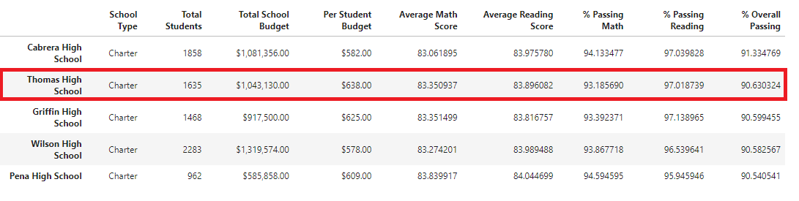

# School_District_Analysis
Module 4 homework

## Table of Contents
- [Overview of Project](#OverviewProject)
  * [Purpose](#purpose)
- [Results](#Results)
- [Summary](#Summary)
- [Resources](#Resources)

 
## Overview of Project

A school distric wants an analysis of their standarized test outcomes for math and reading for various high schools. The data for all students in these high schools was analyzed to find trends in school performance using information such as school size and budget [[3]](#3)[[4]](#4). Aditionally, the data for the Thomas High School 9th grade has been brought into question due to inconsistancies. The analysis was performed with and without this data. The effects of this data removal will be further explained. 

### Purpose

 The analysis will provide the following information for data excluding and including Thomas High School 9th grade [[1]](#1)[[2]](#2).
 
* A high-level snapshot of the district's key metrics
* An overview of the key metrics for each school
* Tables presenting each of the following metrics:
  - Top 5 and bottom 5 performing schools, based on the overall passing rate
  - The average math score received by students in each grade level at each school
  - The average reading score received by students in each grade level at each school
  - School performance based on the budget per student
  - School performance based on the school size 
  - School performance based on the type of school
  
## Results

* How is the district summary affected?

The summary for the district indicates that when excluding the Thomas Highschool 9th Grade from the overall data, the passing percentages are slightly reduced. The overall passing percentage was reduced by a tenth of a percent. The math and reading passing percent were reduced by two and three tenths of a percent respectively. This shows that the Thomas High School 9th grade testing scores were making the percentages higher.   

  

 Figure 1: District Summary Including THS 9th Grade
 

  

 Figure 2: District Summary Excluding THS 9th Grade
 

* How is the school summary affected?

* How does replacing the ninth graders’ math and reading scores affect Thomas High School’s performance relative to the other schools?

The 9th graders' math and reading scores did not affect Thomas High School's ranking with respect to the other schools. In the analysis including and excluding the data, Thomas High School came second in both school rankings. The overall passing percentage is reduced from 90.94% to 90.63% from when including to when excluding the 9th graders' scores. This drop was not significant tnough to move Thomas High School's place. 

  

 Figure 3: Top Schools Including THS 9th Grade
 

  

 Figure 4: Top Schools Excluding THS 9th Grade
 

* How does replacing the ninth-grade scores affect the following:
  - Math and reading scores by grade
  - Scores by school spending
  - Scores by school size
  - Scores by school type

 

##  Summary

[[1]](#1).  

 [[2]](#2). 

...

        candidate_name = row[2]
        county_name =row[1]
       
...

## Resources

<a name="1">[1]</a> [School Distric Analysis without Thomas High School 9th Grade](https://github.com/tamiespinosa/School_District_Analysis/blob/d230e051353b12aff7ec079be477609ec4f7bb8c/PyCitySchools_Challenge.ipynb)

<a name="2">[2]</a> [School District Analysis](https://github.com/tamiespinosa/School_District_Analysis/blob/d230e051353b12aff7ec079be477609ec4f7bb8c/PyCitySchools.ipynb)

<a name="3">[3]</a> [School Data](https://github.com/tamiespinosa/School_District_Analysis/blob/d230e051353b12aff7ec079be477609ec4f7bb8c/Resources/schools_complete.csv)

<a name="4">[4]</a> [Student Data](https://github.com/tamiespinosa/School_District_Analysis/blob/d230e051353b12aff7ec079be477609ec4f7bb8c/Resources/students_complete.csv)

[5] https://docs.github.com/en/get-started/writing-on-github/getting-started-with-writing-and-formatting-on-github/basic-writing-and-formatting-syntax

